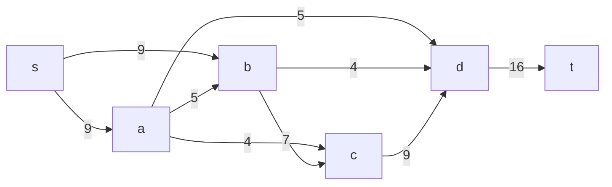

# Задача о максимальном потоке минимальной стоимости.
Для каждого варианта представлены условия задачи, в соответствии с которыми необходимо: 
1. Построить сеть с указанием пропускной способности дуг.
2. Построить остаточную сеть.
3. Определить максимальный поток методом поиска увеличивающих путей в остаточной сети.
4. Проверить величину максимального потока через поиск минимальной пропускной способности разрезов сети.
5. Оформить решение задачи по шагам с подробными комментариями, таблицами и диаграммами.
6. В ответе указать максимальную величину потока и сеть с указанием соответствующих локальных потоков.

## Условие задачи:

### Вариант 7:

| Дуги                      | sa | sb | ad | ab | ac | bc | bd | cd | dt |
|:--------------------------|:--:|:--:|:--:|:--:|:--:|:--:|:--:|:--:|:--:|
| Пропускная способность    | 9  | 9  | 5  | 5  | 4  | 7  | 4  | 9  | 16 |
| Стоимость транспортировки | 1  | 1  | 7  | 1  | 1  | 1  | 5  | 1  | 1  |

## Решение:

### I Шаг - Построим сеть с источником s, стоком t и указанными пропускными способностями дуг для поиска максимального потока:

