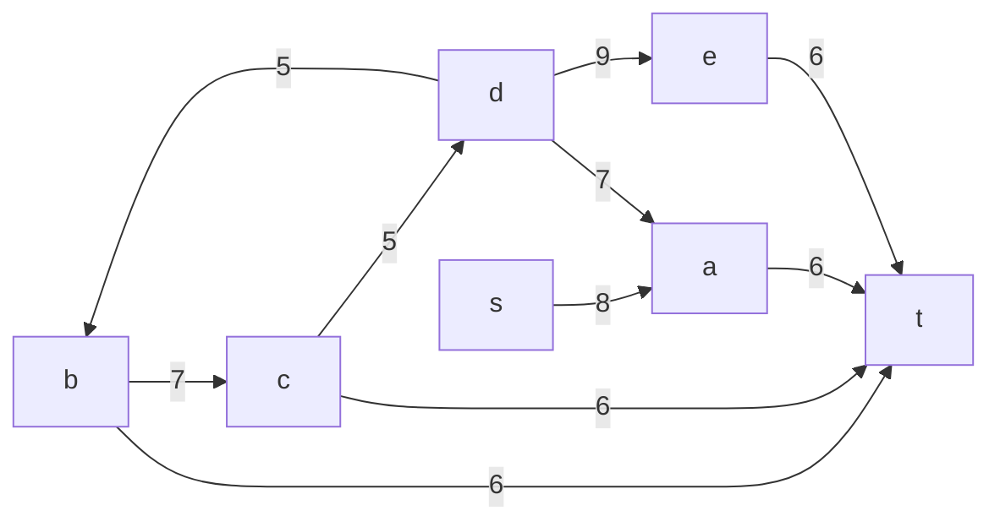

# Задача о максимальном потоке минимальной стоимости.
Для каждого варианта представлены условия задачи, в соответствии с которыми необходимо: 
1. Построить сеть с указанием пропускной способности дуг.
2. Построить остаточную сеть.
3. Определить максимальный поток методом поиска увеличивающих путей в остаточной сети.
4. Проверить величину максимального потока через поиск минимальной пропускной способности разрезов сети.
5. Оформить решение задачи по шагам с подробными комментариями, таблицами и диаграммами.
6. В ответе указать максимальную величину потока и сеть с указанием соответствующих локальных потоков.

## Условие задачи:

### Вариант 9:

|          Дуги          | sa | db | de | da | bc | cd | ct | at | bt | et |
|:----------------------:|:--:|:--:|:--:|:--:|:--:|:--:|:--:|:--:|:--:|:--:|
| Пропускная способность | 8 | 5 | 9 | 7 | 7 | 5 | 6 | 6 | 6 | 6
| Стоимость транспортировки| 2 | 2 | 4 | 4 | 2 | 3 | 2 | 2 | 4 | 4

## Решение:

### I Шаг - Построим сеть с источником s, стоком t и указанными пропускными способностями дуг для поиска максимального потока:

Укажем начальный поток величины 5: **s ->b -> d-> t**. Построим соответствующую остаточную сеть:
