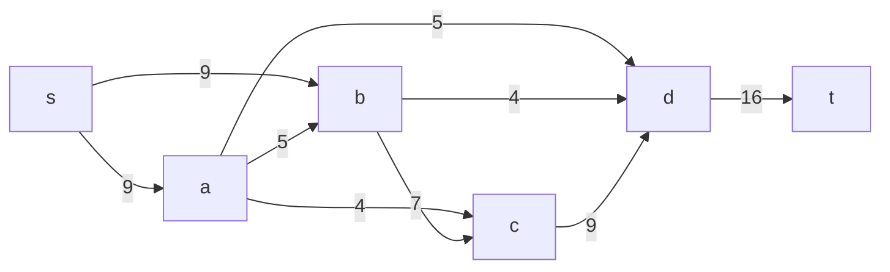
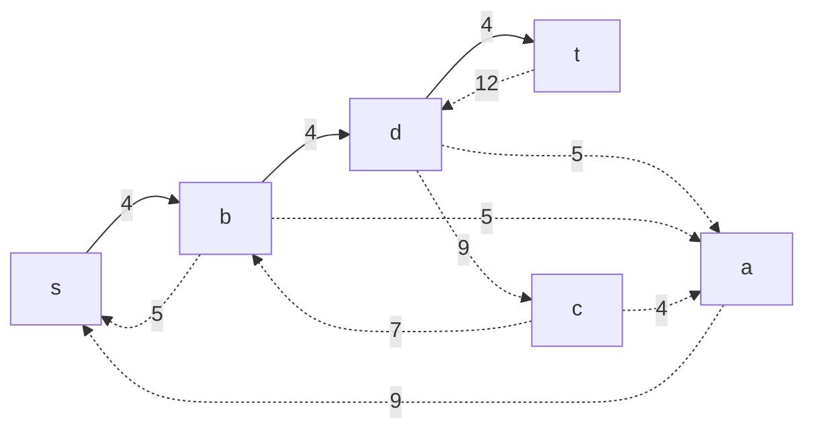
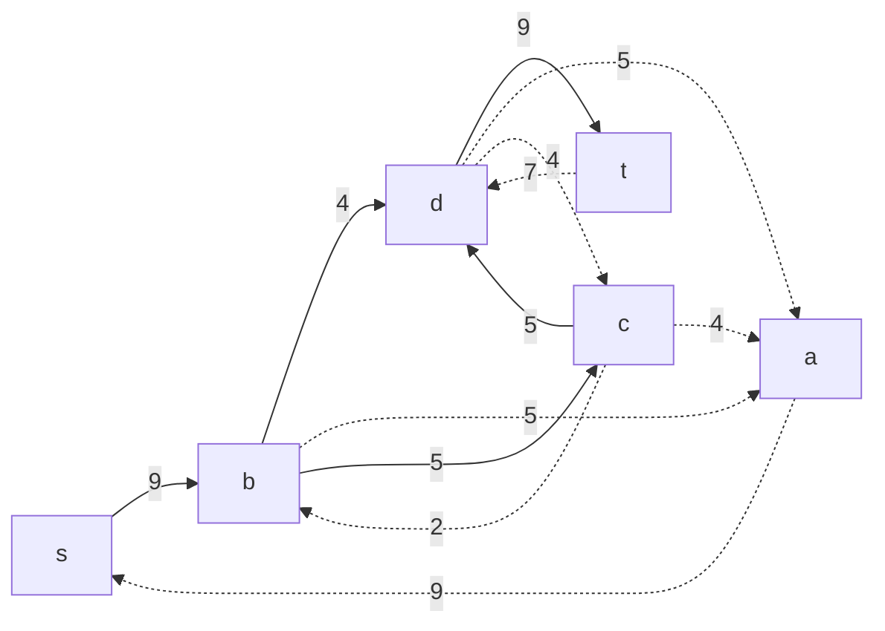
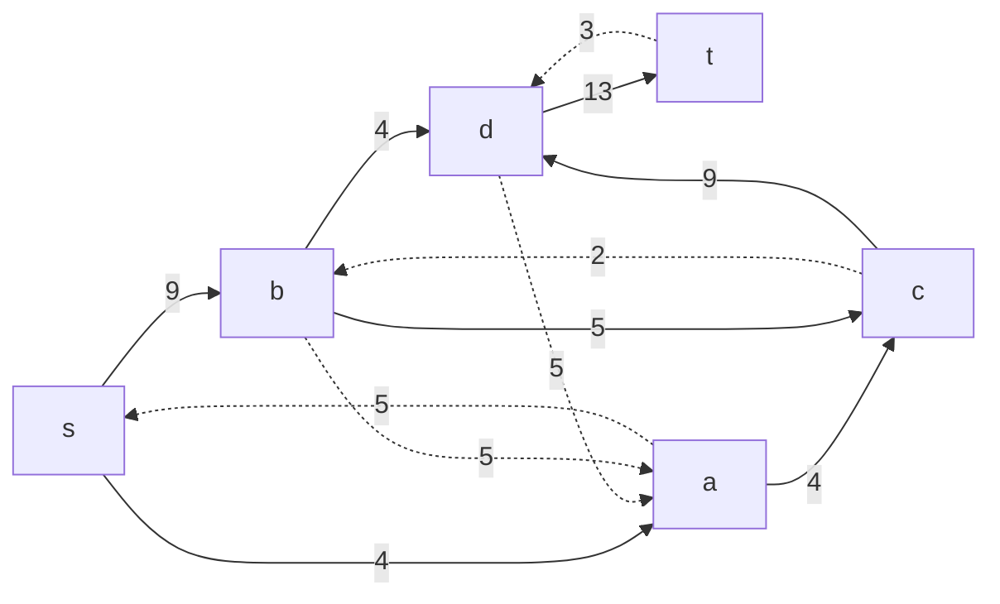
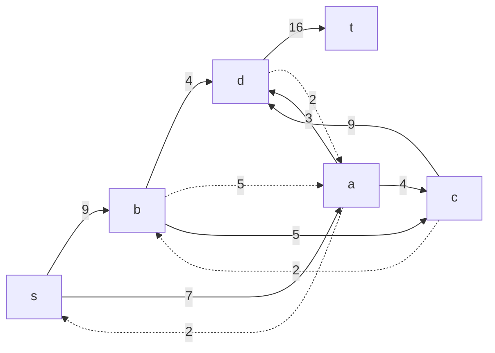
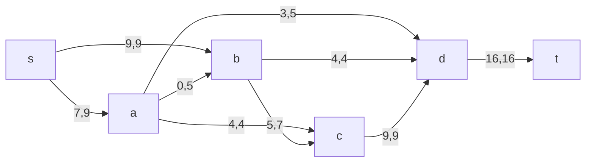

# Задача о максимальном потоке минимальной стоимости.

Для каждого варианта представлены условия задачи, в соответствии с которыми необходимо:

1. Построить сеть с указанием пропускной способности дуг.
2. Построить остаточную сеть.
3. Определить максимальный поток методом поиска увеличивающих путей в остаточной сети.
4. Проверить величину максимального потока через поиск минимальной пропускной способности разрезов сети.
5. Оформить решение задачи по шагам с подробными комментариями, таблицами и диаграммами.
6. В ответе указать максимальную величину потока и сеть с указанием соответствующих локальных потоков.

## Условие задачи:

### Вариант 7:

| Дуги                      | sa  | sb  | ad  | ab  | ac  | bc  | bd  | cd  | dt  |
| :------------------------ | :-: | :-: | :-: | :-: | :-: | :-: | :-: | :-: | :-: |
| Пропускная способность    |  9  |  9  |  5  |  5  |  4  |  7  |  4  |  9  | 16  |
| Стоимость транспортировки |  1  |  1  |  7  |  1  |  1  |  1  |  5  |  1  |  1  |

## Решение:

### I Шаг - Построим сеть с источником s, стоком t и указанными пропускными способностями дуг для поиска максимального потока:

Укажем начальный поток величины 4: **s -> b -> d -> t**. Построим соответствующую остаточную сеть:

### II Шаг - Проведем поиск увеличивающего пути в остаточной сети

В остаточной сети найден увеличивающий путь t -> d -> c -> b -> s. Минимальный вес дуг на этом пути равен 5.
Уменьшим вес дуг на найденном пути, a дуги, для которых вес стал нулевым, удалим из остаточной сети.

### III Шаг - Продолжим поиск увеличивающего пути в остаточной сети

В остаточной сети найден увеличивающий путь t -> d -> c -> a -> s. Минимальный вес дуг на этом пути равен 4.
Уменьшим вес дуг на найденном пути, дуги для которых вес стал нулевым удалим из остаточной сети.

### IV Шаг - Продолжим поиск увеличивающего пути в остаточной сети

В остаточной сети найден увеличивающий путь t -> d -> a -> s. Минимальный вес дуг на этом пути равен 3.
Уменьшим вес дуг на найденном пути, дуги для которых вес стал нулевым удалим из остаточной сети.

### V Шаг - Продолжим поиск увеличивающего пути в остаточной сети.

В остаточной сети не найден увеличивающие пути, следовательно, алгоритм завершил свою работу и найденный поток величиной 16 является максимальным для данной сети:

### VI Шаг - Рассчитаем стоимость полученного максимального потока.

|            | sa  | sb  | ad  | ab  | ac  | bc  | bd  | cd  | dt  | Итог   |
| ---------- | --- | --- | --- | --- | --- | --- | --- | --- | --- | ------ |
| P(e)       | 9   | 9   | 5   | 5   | 4   | 7   | 4   | 9   | 16  |        |
| F(e)       | 7   | 9   | 3   | 0   | 4   | 5   | 4   | 9   | 16  |
| C(e)       | 1   | 1   | 7   | 1   | 1   | 1   | 5   | 1   | 1   |
| F(e)\*C(e) | 7  | 9  | 35   | 0   | 4  | 5   | 20  | 9   | 16  | **105** |
Стоимость полученного потока составляет 105
